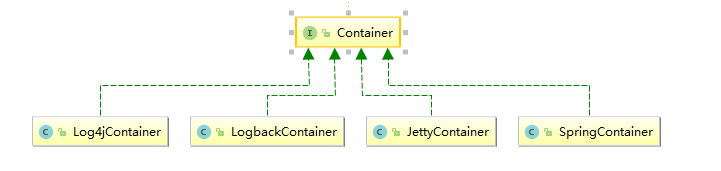

# dubbo

## 代码实例

> dubbo-demo

## Main方法的启动

```java
public class App 
{
    public static void main(String[] args)
    {
        Main.main(args);
    }
}
```

####  Main.main

```java
    
public static final String CONTAINER_KEY = "dubbo.container";

public static final String SHUTDOWN_HOOK_KEY = "dubbo.shutdown.hook";

private static final Logger logger = LoggerFactory.getLogger(Main.class);

private static final ExtensionLoader<Container> loader = 		    ExtensionLoader.getExtensionLoader(Container.class);
    
    private static volatile boolean running = true;
public static void main(String[] args) {
        try {
            if (args == null || args.length == 0) {
                String config = ConfigUtils.getProperty(CONTAINER_KEY, loader.getDefaultExtensionName());
                args = Constants.COMMA_SPLIT_PATTERN.split(config);
            }
            
            final List<Container> containers = new ArrayList<Container>();
            
            //dubbo的扩展机制
            for (int i = 0; i < args.length; i ++) {
                containers.add(loader.getExtension(args[i]));
            }
            
            logger.info("Use container type(" + Arrays.toString(args) + ") to run dubbo serivce.");
            
            if ("true".equals(System.getProperty(SHUTDOWN_HOOK_KEY))) {
	            Runtime.getRuntime().addShutdownHook(new Thread() {
	                public void run() {
	                    for (Container container : containers) {
	                        try {
	                            container.stop();
	                            logger.info("Dubbo " + container.getClass().getSimpleName() + " stopped!");
	                        } catch (Throwable t) {
	                            logger.error(t.getMessage(), t);
	                        }
	                        synchronized (Main.class) {
	                            running = false;
	                            Main.class.notify();
	                        }
	                    }
	                }
	            });
            }
            
            //dubbo提供的容器
            for (Container container : containers) {
                container.start();
                logger.info("Dubbo " + container.getClass().getSimpleName() + " started!");
            }
            System.out.println(new SimpleDateFormat("[yyyy-MM-dd HH:mm:ss]").format(new Date()) + " Dubbo service server started!");
        } catch (RuntimeException e) {
            e.printStackTrace();
            logger.error(e.getMessage(), e);
            System.exit(1);
        }
        synchronized (Main.class) {
            while (running) {
                try {
                    Main.class.wait();
                } catch (Throwable e) {
                }
            }
        }
    }
    
```

##### dubbo提供的容器



##### SpringContainer

```java
    
public static final String DEFAULT_SPRING_CONFIG = "classpath*:META-INF/spring/*.xml";

public void start() {
        String configPath = ConfigUtils.getProperty(SPRING_CONFIG);
        if (configPath == null || configPath.length() == 0) {
            //默认加载META-INF/spring/*.xml
            configPath = DEFAULT_SPRING_CONFIG;
        }
      //加载spring
        context = new ClassPathXmlApplicationContext(configPath.split("[,\\s]+"));
        context.start();
    }

```


## 日志的集成

```java
public class LoggerFactory {
    	static {
	    String logger = System.getProperty("dubbo.application.logger");
	    if ("slf4j".equals(logger)) {
    		setLoggerAdapter(new Slf4jLoggerAdapter());
    	} else if ("jcl".equals(logger)) {
    		setLoggerAdapter(new JclLoggerAdapter());
    	} else if ("log4j".equals(logger)) {
    		setLoggerAdapter(new Log4jLoggerAdapter());
    	} else if ("jdk".equals(logger)) {
    		setLoggerAdapter(new JdkLoggerAdapter());
    	} else {
    		try {
    			setLoggerAdapter(new Log4jLoggerAdapter());
            } catch (Throwable e1) {
                try {
                	setLoggerAdapter(new Slf4jLoggerAdapter());
                } catch (Throwable e2) {
                    try {
                    	setLoggerAdapter(new JclLoggerAdapter());
                    } catch (Throwable e3) {
                        setLoggerAdapter(new JdkLoggerAdapter());
                    }
                }
            }
    	}
	}
}
```


## ADMIN控制台安装

1. 下载dubbo的源码

   > https://github.com/apache/incubator-dubbo-admin/

3. 修改webapp/WEB-INF/dubbo.properties

dubbo.registry.address=zookeeper的集群地址


> 控制中心是用来做服务治理的，比如控制服务的权重、服务的路由

## SIMPLE监控中心

Monitor也是一个dubbo服务，所以也会有端口和url

 

修改/conf目录下dubbo.properties /order-provider.xml

dubbo.registry.address=zookeeper的集群地址

 

监控服务的调用次数、调用关系、响应事件


