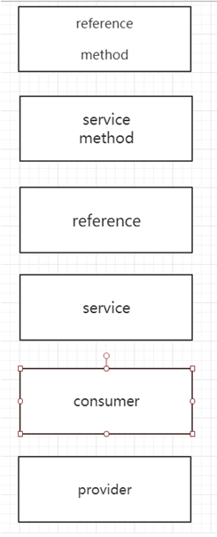

# dubbo

## 代码实例

> dubbo-demo

## Main方法的启动

```java
public class App 
{
    public static void main(String[] args)
    {
        Main.main(args);
    }
}
```

####  Main.main

```java
    
public static final String CONTAINER_KEY = "dubbo.container";

public static final String SHUTDOWN_HOOK_KEY = "dubbo.shutdown.hook";

private static final Logger logger = LoggerFactory.getLogger(Main.class);

private static final ExtensionLoader<Container> loader = 		    ExtensionLoader.getExtensionLoader(Container.class);
    
    private static volatile boolean running = true;
public static void main(String[] args) {
        try {
            if (args == null || args.length == 0) {
                String config = ConfigUtils.getProperty(CONTAINER_KEY, loader.getDefaultExtensionName());
                args = Constants.COMMA_SPLIT_PATTERN.split(config);
            }
            
            final List<Container> containers = new ArrayList<Container>();
            
            //dubbo的扩展机制
            for (int i = 0; i < args.length; i ++) {
                containers.add(loader.getExtension(args[i]));
            }
            
            logger.info("Use container type(" + Arrays.toString(args) + ") to run dubbo serivce.");
            
            if ("true".equals(System.getProperty(SHUTDOWN_HOOK_KEY))) {
	            Runtime.getRuntime().addShutdownHook(new Thread() {
	                public void run() {
	                    for (Container container : containers) {
	                        try {
	                            container.stop();
	                            logger.info("Dubbo " + container.getClass().getSimpleName() + " stopped!");
	                        } catch (Throwable t) {
	                            logger.error(t.getMessage(), t);
	                        }
	                        synchronized (Main.class) {
	                            running = false;
	                            Main.class.notify();
	                        }
	                    }
	                }
	            });
            }
            
            //dubbo提供的容器
            for (Container container : containers) {
                container.start();
                logger.info("Dubbo " + container.getClass().getSimpleName() + " started!");
            }
            System.out.println(new SimpleDateFormat("[yyyy-MM-dd HH:mm:ss]").format(new Date()) + " Dubbo service server started!");
        } catch (RuntimeException e) {
            e.printStackTrace();
            logger.error(e.getMessage(), e);
            System.exit(1);
        }
        synchronized (Main.class) {
            while (running) {
                try {
                    Main.class.wait();
                } catch (Throwable e) {
                }
            }
        }
    }
    
```

##### dubbo提供的容器


##### SpringContainer

```java
    
public static final String DEFAULT_SPRING_CONFIG = "classpath*:META-INF/spring/*.xml";

public void start() {
        String configPath = ConfigUtils.getProperty(SPRING_CONFIG);
        if (configPath == null || configPath.length() == 0) {
            //默认加载META-INF/spring/*.xml
            configPath = DEFAULT_SPRING_CONFIG;
        }
      //加载spring
        context = new ClassPathXmlApplicationContext(configPath.split("[,\\s]+"));
        context.start();
    }

```


## 日志的集成

```java
public class LoggerFactory {
    	static {
	    String logger = System.getProperty("dubbo.application.logger");
	    if ("slf4j".equals(logger)) {
    		setLoggerAdapter(new Slf4jLoggerAdapter());
    	} else if ("jcl".equals(logger)) {
    		setLoggerAdapter(new JclLoggerAdapter());
    	} else if ("log4j".equals(logger)) {
    		setLoggerAdapter(new Log4jLoggerAdapter());
    	} else if ("jdk".equals(logger)) {
    		setLoggerAdapter(new JdkLoggerAdapter());
    	} else {
    		try {
    			setLoggerAdapter(new Log4jLoggerAdapter());
            } catch (Throwable e1) {
                try {
                	setLoggerAdapter(new Slf4jLoggerAdapter());
                } catch (Throwable e2) {
                    try {
                    	setLoggerAdapter(new JclLoggerAdapter());
                    } catch (Throwable e3) {
                        setLoggerAdapter(new JdkLoggerAdapter());
                    }
                }
            }
    	}
	}
}
```


## ADMIN控制台安装

1. 下载dubbo的源码

   > https://github.com/apache/incubator-dubbo-admin/

3. 修改webapp/WEB-INF/dubbo.properties

dubbo.registry.address=zookeeper的集群地址


> 控制中心是用来做服务治理的，比如控制服务的权重、服务的路由

## SIMPLE监控中心

Monitor也是一个dubbo服务，所以也会有端口和url

 

修改/conf目录下dubbo.properties /order-provider.xml

dubbo.registry.address=zookeeper的集群地址

 

监控服务的调用次数、调用关系、响应事件


## 启动服务检查

如果提供方没有启动的时候，默认会去检测所依赖的服务是否正常提供服务

如果check为false，表示启动的时候不去检查。当服务出现循环依赖的时候，check设置成false

dubbo:reference  属性： check默认值是true、false

 dubbo:consumer  check=”false”没有服务提供者的时候，报错

dubbo:registry  check=false注册订阅失败报错

## 多协议支持

dubbo支持的协议： dubbo、RMI、**hessian**、webservice、http、Thrift

#### hessian为例

##### 引入jar包

```xml
<dependency>
    <groupId>com.caucho</groupId>
    <artifactId>hessian</artifactId>
    <version>4.0.38</version>
</dependency>
<dependency>
    <groupId>javax.servlet</groupId>
    <artifactId>servlet-api</artifactId>
    <version>2.5</version>
</dependency>
<dependency>
    <groupId>org.mortbay.jetty</groupId>
    <artifactId>jetty</artifactId>
    <version>6.1.26</version>
</dependency>
```

##### 修改provider.xml

```xml
  <dubbo:protocol name="hessian" port="20880" server="jetty"/>
```

##### 指定service服务的协议版本号

```xml
<!--发布的接口-->
<dubbo:service interface="cn.zhangspace.IOrderService" ref="OrderService" protocol="hessian"/>
```

##### 消费端改造

```xml
 <dubbo:reference id="orderServices" interface="cn.zhangspace.IOrderService" protocol="hessian"/>
```

## 多注册中心支持

```xml
<dubbo:registry  id ="one" address="zookeeper://192.168.78.129:2181" timeout="10000"/>

<dubbo:registry id ="two" address="zookeeper://192.168.78.128:2181" timeout="10000"/>
```

```xml
    <dubbo:service interface="cn.zhangspace.IOrderService" ref="OrderService" protocol="hessian" register="one"/>
    <dubbo:service interface="cn.zhangspace.IOrderService" ref="OrderService" protocol="hessian" register="two"/>
```

## 多版本支持

```xml

<dubbo:service interface="cn.zhangspace.IOrderService" ref="OrderService" version="0.0.0" protocol="hessian" />
<dubbo:service interface="cn.zhangspace.IOrderService" ref="OrderService2" version="0.0.1" protocol="hessian" />

<bean id="OrderService" class="cn.zhangspace.OrderServiceImpl"/>
<bean id="OrderService2" class="cn.zhangspace.OrderServiceImpl2"/>
```

```xml
<dubbo:reference id="orderServices" interface="cn.zhangspace.IOrderService" protocol="hessian" version="0.0.1"/>

```

## 异步调用

> hessian协议，使用async异步回调会报错

```xml
    <dubbo:reference id="orderServices" interface="cn.zhangspace.IOrderService" protocol="hessian" version="0.0.1" async="true"/>

```

```java
services.doOrder(request);
Future<DoOrderResponse> response1 = RpcContext.getContext().getFuture();
DoOrderResponse response = response1.get();
```

## 主机绑定

> ServiceConfig#doExportUrlsFor1Protocol

```java
//1.	通过<dubbo:protocol host配置的地址去找  
String host = protocolConfig.getHost();
        if (provider != null && (host == null || host.length() == 0)) {
            host = provider.getHost();
        }
        if (NetUtils.isInvalidLocalHost(host)) {
            anyhost = true;
            try {
                //2. 获取本机的地址
                host = InetAddress.getLocalHost().getHostAddress();
            } catch (UnknownHostException e) {
                logger.warn(e.getMessage(), e);
            }
            if (NetUtils.isInvalidLocalHost(host)) {
                if (registryURLs != null && registryURLs.size() > 0) {
                    for (URL registryURL : registryURLs) {
                        try {
                            Socket socket = new Socket();
                            try {
                                //3.	通过socket发起连接连接到注册中心的地址。再获取连接过去以后本地的ip地址
                                SocketAddress addr = new InetSocketAddress(registryURL.getHost(), registryURL.getPort());
                                socket.connect(addr, 1000);
                                host = socket.getLocalAddress().getHostAddress();
                                break;
                            } finally {
                                try {
                                    socket.close();
                                } catch (Throwable e) {}
                            }
                        } catch (Exception e) {
                            logger.warn(e.getMessage(), e);
                        }
                    }
                }
                if (NetUtils.isInvalidLocalHost(host)) {
                    //4. 通过NetUtils.getLocalHost()
                    host = NetUtils.getLocalHost();
                }
            }
        }

```

## dubbo只订阅不注册

```xml
    <dubbo:registry  address="zookeeper://192.168.78.129:2181" timeout="10000" register="false"/>

```

## dubbo只注册不订阅

```xml
    <dubbo:registry  address="zookeeper://192.168.78.129:2181" timeout="10000" subscribe="false"/>
```


## 负载均衡

> 缺省为random随机调用
>
> AbstractLoadBalance

```xml
    <dubbo:service interface="cn.zhangspace.IOrderService" ref="OrderService" version="0.0.0" protocol="dubbo" loadbalance="random" />
```

#### Random LoadBalance

随机，按权重设置随机概率。

在一个截面上碰撞的概率高，但调用量越大分布越均匀，而且按概率使用权重后也比较均匀，有利于动态调整提供者权重。

#### RoundRobin LoadBalance

轮循，按公约后的权重设置轮循比率。

存在慢的提供者累积请求的问题，比如：第二台机器很慢，但没挂，当请求调到第二台时就卡在那，久而久之，所有请求都卡在调到第二台上。

#### LeastActive LoadBalance

最少活跃调用数，相同活跃数的随机，活跃数指调用前后计数差。

使慢的提供者收到更少请求，因为越慢的提供者的调用前后计数差会越大。

#### ConsistentHash LoadBalance

一致性Hash，相同参数的请求总是发到同一提供者。

当某一台提供者挂时，原本发往该提供者的请求，基于虚拟节点，平摊到其它提供者，不会引起剧烈变动。

## 连接超时timeout

>  必须要设置服务的处理的超时时间

## 集群容错

```xml
    <dubbo:reference id="orderServices"  cluster="failsafe" interface="cn.zhangspace.IOrderService" protocol="dubbo" version="0.0.1" async="true"/>

```


#### Failover cluster(默认)

 失败的时候自动切换并重试其他服务器。 通过retries=2。 来设置重试次数

##### 使用场景

通常用于读操作

#### Failfast cluster

快速失败，只发起一次调用  

##### 使用场景

> 当写操作时，没有返回正确的响应码，对于后台可能失败也可能成功。比如新增记录的时候， 非幂等请求。可以用到快速失败

#### Failsafe cluster 

失败安全。 出现异常时，直接忽略异常

##### 使用场景

> 需要输出到日志的时候，失败之后对业务没有什么影响。

#### Failback cluster 

失败自动恢复。后台记录失败请求，定时重发

##### 使用场景

通常用于消息通知操作。

#### Forking cluster

并行调用多个服务器，只要一个成功就返回。 

##### 使用场景

只能应用在读请求

#### Broadcast cluster

广播调用所有提供者，逐个调用。其中一台报错就会返回异常


## 配置的优先级

> 客服端timeout=2000  服务器端timeout=5000 最终调用以哪个为主？
>
> 消费端有限最高 – 服务端

```xml
    <dubbo:service interface="cn.zhangspace.IOrderService" ref="OrderService" version="0.0.0" protocol="dubbo" loadbalance="random" timeout="5000"/>


    <dubbo:service interface="cn.zhangspace.IOrderService" ref="OrderService" version="0.0.0" protocol="dubbo" loadbalance="random" timeout="5000">
            <dubbo:method name="doPay" timeout="3000"/>
    </dubbo:service>

    <dubbo:reference id="orderServices"  cluster="failsafe" interface="cn.zhangspace.IOrderService" protocol="dubbo" version="0.0.1" async="true" timeout="2000"/>


    <dubbo:reference id="orderServices"  cluster="failsafe" interface="cn.zhangspace.IOrderService" protocol="dubbo" version="0.0.1" async="true" timeout="2000">
		<dubbo:method name="doPay" timeout="3000"/>
</dubbo:reference>

```



