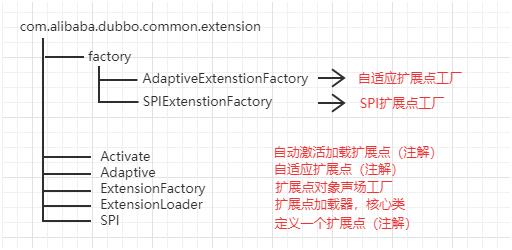
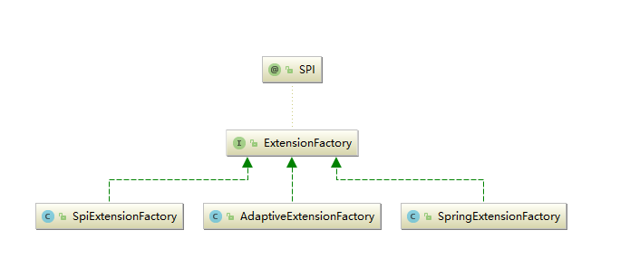

## Dubbo SPI机制源码阅读


#### Dubbo SPI和JAVASPI的使用和对比

#### javaspi

##### javaSPI规范总结

实现SPI，就需要按照SPI本身定义的规范来进行配置，SPI规范如下

1. 需要在classpath下创建一个目录，该目录命名必须是：META-INF/services

2. 在该目录下创建一个properties文件，该文件需要满足以下几个条件

   a)  文件名必须是扩展的接口的全路径名称

   b)  文件内部描述的是该扩展接口的所有实现类

   c)  文件的编码格式是UTF-8

3. 通过java.util.ServiceLoader的加载机制来发现

##### javaSPI缺点

1. JDK标准的SPI会一次性加载实例化扩展点的所有实现

   > JDK启动的时候都会一次性全部加载。那么如果有的扩展点实现初始化很耗时或者如果有些实现类并没有用到，那么会很浪费资源

2. 如果扩展点加载失败，会导致调用方报错，而且这个错误很难定位到是这个原因


#### dubbospi

##### dubbospi规范总结

大部分的思想都是和SPI是一样，只是下面两个地方有差异。

1. 需要在resource目录下配置META-INF/dubbo或者META-INF/dubbo/internal或者META-INF/services，并基于SPI接口去创建一个文件

2. 文件名称和接口名称保持一致，文件内容和SPI有差异，内容是KEY对应Value


#### 切入点

```java
public class ServiceConfig<T> extends AbstractServiceConfig {
        private static final Protocol protocol = ExtensionLoader.getExtensionLoader(Protocol.class).getAdaptiveExtension();
}
```

#### Extension

##### 自定义扩展

```java
//默认的Protocol  
Protocol protocol = ExtensionLoader.getExtensionLoader(Protocol.class).getDefaultExtension();
 
//自动扩展
Protocol protocol =  	ExtensionLoader.getExtensionLoader(Protocol.class).getExtension("myprotocol");

META-INF\dubbo\com.alibaba.dubbo.rpc.Protocol
> myprotocol=cn.zhangspace.MyProtocol


```


##### Extension源码的结构





